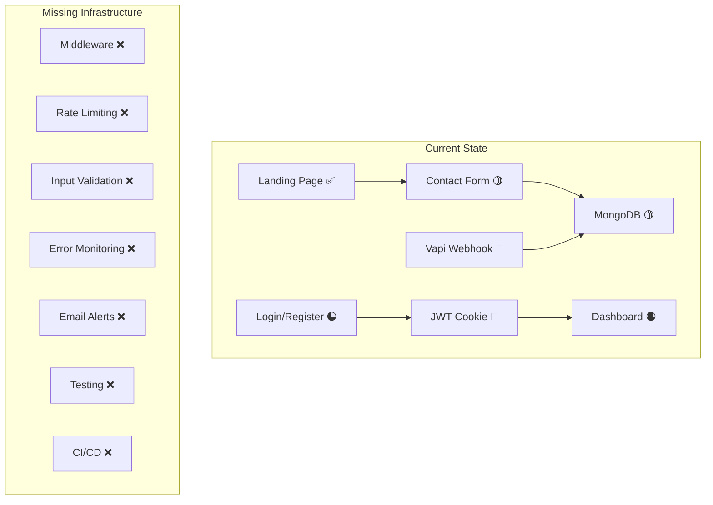

# 🔍 Voxora AI — Full Production Audit Report

**Project**: Voxora AI (`voxora-ai`)
**Stack**: Next.js 16 + React 19 + MongoDB/Mongoose + Tailwind v4
**Audit Date**: June 20, 2026
**Auditor**: Senior Dev Review

---

## Executive Summary

Voxora is a well-designed landing page + admin dashboard for an AI voice receptionist SaaS. The UI work is polished and the core concept is solid. However, **the project is NOT production-ready for client-facing outreach**. There are critical security holes, missing infrastructure, and foundational gaps that must be addressed before you put real client data through this system.

**Severity counts**: 🔴 Critical: 7 | 🟠 High: 9 | 🟡 Medium: 11 | 🔵 Low: 6

---

## 🔴 CRITICAL Security Flaws

### 1. Hardcoded JWT Secret in `.env`

**File**: [.env](file:///d:/CODE/voiceflow/.env)

```
JWT_SECRET=default_super_secret_voiceflow_ai_key_change_in_production
```

> [!CAUTION]
> This is a **default, guessable secret**. Anyone who reads your repo (or guesses this string) can forge admin tokens and access your entire dashboard. Even though `.env` is gitignored, this default value is dangerous — if you ever deploy without overriding it, your auth is completely broken.

**Fix**: Generate a cryptographically random secret (`openssl rand -base64 64`), use `.env.local` for local dev, and enforce a strong secret in production via deployment env vars.

---

### 2. Cookie `secure: false` — Tokens Sent Over HTTP

**File**: [login/route.ts](file:///d:/CODE/voiceflow/src/app/api/auth/login/route.ts#L58-L64)

```typescript
res.cookies.set("token", token, {
  httpOnly: true,
  path: "/",
  sameSite: "lax",
  secure: false,       // ← 🔴 TOKENS TRAVEL IN PLAINTEXT
  maxAge: 60 * 60 * 24 * 7,
});
```

> [!CAUTION]
> With `secure: false`, the JWT cookie is transmitted over plain HTTP. Any network observer (coffee shop WiFi, ISP, etc.) can steal your admin token. In production this **must** be `secure: true` (or conditional on `NODE_ENV`).

**Fix**:
```typescript
secure: process.env.NODE_ENV === "production",
```

---

### 3. Webhook Endpoint Has ZERO Authentication

**File**: [vapi-webhook/route.ts](file:///d:/CODE/voiceflow/src/app/api/vapi-webhook/route.ts#L13-L15)

```typescript
export async function POST(request: Request) {
  const payload = await request.json();
  // No auth check, no signature verification, no API key — anyone can call this
```

> [!CAUTION]
> Anyone on the internet can `POST` to `/api/vapi-webhook` and:
> - **Book fake appointments** (inject garbage into your DB)
> - **Cancel real appointments** by guessing tracking codes (only 3 chars = ~46K combos, easily brute-forced)
> - **Reschedule appointments** to arbitrary times
>
> This is a **database manipulation endpoint with zero protection**.

**Fix**: Validate Vapi's webhook signature header, or at minimum require a shared secret/API key in a custom header.

---

### 4. Contact API — Mass-Assignment / NoSQL Injection Risk

**File**: [contact/route.ts](file:///d:/CODE/voiceflow/src/app/api/contact/route.ts#L7-L8)

```typescript
const body = await req.json();
const contact = await Contact.create(body);  // ← 🔴 Entire request body goes straight to DB
```

> [!CAUTION]
> The raw request body is passed directly to `Contact.create()`. An attacker can:
> - Inject arbitrary fields into your MongoDB collection (`_id`, `createdAt` overrides, `__proto__` pollution)
> - Store enormous payloads (no size limit)
> - Submit thousands of spam entries (no rate limiting)

**Fix**: Destructure and validate only expected fields:
```typescript
const { name, email, company, phone, message } = await req.json();
// + add validation with zod or similar
const contact = await Contact.create({ name, email, company, phone, message });
```

---

### 5. Register Route — Unprotected JSON Parse Crash

**File**: [register/route.ts](file:///d:/CODE/voiceflow/src/app/api/auth/register/route.ts#L19)

```typescript
const { name, email, password } = await req.json();  // ← Crashes on invalid JSON
```

Unlike the login route (which has safe JSON parsing), the register route will throw an **unhandled exception** on malformed requests, potentially leaking stack traces.

---

### 6. No Middleware — No Route Protection

There is **no `middleware.ts`** file anywhere in the project. This means:

- The `/dashboards` route is "protected" only by a client-side `useEffect` that calls `/api/auth/me`
- A user can **see the dashboard HTML/JS** before the redirect fires
- Anyone can directly access dashboard API routes if they know the URLs
- There's no server-side redirect for unauthenticated users

**Fix**: Add a Next.js middleware that checks the JWT cookie and redirects unauthenticated users at the edge.

---

### 7. Weak Tracking Code Generation — Brute-Forceable

**File**: [vapi-webhook/route.ts](file:///d:/CODE/voiceflow/src/app/api/vapi-webhook/route.ts#L4-L11)

```typescript
const generateTrackingCode = (prefix = "APX-", length = 3) => {
  // Only 36^3 = 46,656 possible codes — trivially brute-forceable
```

Combined with the unauthenticated webhook endpoint, an attacker can enumerate all possible codes and cancel/reschedule every appointment.

---

## 🟠 HIGH Priority Issues

### 8. No Rate Limiting — Anywhere

Not a single API route has rate limiting. Your system is vulnerable to:
- **Brute-force login attacks** (unlimited password attempts)
- **Contact form spam** (bots can flood your DB)
- **Webhook abuse** (unlimited fake appointments)
- **DDoS on API routes**

**Fix**: Use something like `next-rate-limit`, Upstash rate limiting, or Vercel Edge rate limiting.

---

### 9. No CSRF Protection

There's no CSRF token implementation. While `sameSite: "lax"` on cookies provides some protection, it's not complete — attackers on sub-domains or via certain browser behaviors can still perform cross-site requests.

---

### 10. No Security Headers

No `Content-Security-Policy`, `X-Frame-Options`, `X-Content-Type-Options`, `Strict-Transport-Security`, `Referrer-Policy`, or `Permissions-Policy` headers are set anywhere. 

**Fix**: Add security headers in `next.config.ts`:
```typescript
async headers() {
  return [{
    source: "/(.*)",
    headers: [
      { key: "X-Frame-Options", value: "DENY" },
      { key: "X-Content-Type-Options", value: "nosniff" },
      { key: "Referrer-Policy", value: "strict-origin-when-cross-origin" },
      { key: "Strict-Transport-Security", value: "max-age=31536000; includeSubDomains" },
    ],
  }];
}
```

---

### 11. No Input Validation Library

No Zod, Joi, or any schema validation library is used. All user input is accepted as-is. This affects:
- Login (email format not validated server-side)
- Register (password strength not enforced server-side, only 6 chars on client)
- Contact form (no sanitization)
- Webhook payloads (completely trusted)

---

### 12. No `.env.example` File

There's no `.env.example` or `.env.template` file. New developers (or deployment pipelines) have no idea what environment variables are required.

---

### 13. Error Messages Leak Info in Register

**File**: [register/route.ts](file:///d:/CODE/voiceflow/src/app/api/auth/register/route.ts#L30-L35)

```typescript
if (existingUser) {
  return NextResponse.json(
    { message: "User already exists" },  // ← Confirms email exists in DB
```

This enables email enumeration. An attacker can discover which emails have accounts.

---

### 14. Mongoose Schema Missing Validation

**File**: [User.ts](file:///d:/CODE/voiceflow/src/models/User.ts)

```typescript
const UserSchema = new mongoose.Schema({
  name: String,           // ← No required, no minlength
  email: { type: String, unique: true },  // ← No email format validation
  password: String,       // ← No required
});
```

The User model allows documents with empty email, empty password, or no name. Same issue with [Contact.ts](file:///d:/CODE/voiceflow/src/models/Contact.ts) — all fields are optional.

---

### 15. Dashboard Auth is Client-Side Only

**File**: [dashboards/layout.tsx](file:///d:/CODE/voiceflow/src/app/dashboards/layout.tsx#L21-L32)

The dashboard "protection" is just a `useEffect` fetch. The page component, all its JavaScript, and the HTML structure are sent to the client before any auth check happens. Server-side protection via middleware is needed.

---

### 16. `verifyToken` Does Not Validate Payload Shape

**File**: [auth.ts](file:///d:/CODE/voiceflow/src/lib/auth.ts#L11-L13)

```typescript
export function verifyToken(token: string) {
  return jwt.verify(token, JWT_SECRET);  // ← Returns `any`, no type narrowing
}
```

The decoded payload is used directly without checking that it actually contains `userId`. A crafted JWT with a valid signature but missing `userId` would pass verification.

---

## 🟡 MEDIUM Priority Issues

### 17. No Error Monitoring / Logging Service

Only `console.error` is used. You have zero visibility into production errors. Need Sentry, LogRocket, or similar.

---

### 18. No Email Notification on Contact Form

Leads sit in MongoDB until someone checks the dashboard. No email/Slack alert when a new lead comes in — you could miss hot leads for days.

---

### 19. MongoDB Running on localhost

```
MONGODB_URI=mongodb://127.0.0.1:27017/voiceflow
```

This won't work in production. You need MongoDB Atlas or a hosted MongoDB instance with auth, TLS, and connection pooling.

---

### 20. No Pagination on Dashboard

[dashboards/page.tsx](file:///d:/CODE/voiceflow/src/app/dashboards/page.tsx) fetches ALL contacts at once. With hundreds of leads, this will become slow and memory-intensive.

---

### 21. No Loading/Error States on Dashboard Fetch Failure

The dashboard silently fails if the contacts API errors out — no retry logic, no user-facing error.

---

### 22. CSV Export Vulnerability — Comma Injection

[dashboards/page.tsx](file:///d:/CODE/voiceflow/src/app/dashboards/page.tsx#L48-L66)

```typescript
(c.message ?? "").replace(/,/g, ";"),  // ← Only replaces commas
```

This doesn't prevent CSV injection. Malicious values starting with `=`, `+`, `-`, or `@` can execute formulas when opened in Excel.

---

### 23. No Password Reset Flow

There's no forgot-password, email verification, or password reset functionality. If the single admin account loses access, there's no recovery path.

---

### 24. No Test Suite

Zero tests — no unit tests, no integration tests, no E2E tests. You're deploying blind.

---

### 25. Phone Number in Constants Is Raw

[constants.ts](file:///d:/CODE/voiceflow/src/lib/constants.ts#L27):
```typescript
phone: "7860135069",  // ← No country code, not formatted
```

---

### 26. Dead/Broken Footer Links

[constants.ts](file:///d:/CODE/voiceflow/src/lib/constants.ts#L298-L303):
```typescript
company: [
  { label: "About", href: "#" },     // ← Dead link
  { label: "Careers", href: "#" },    // ← Dead link
  { label: "Blog", href: "#" },      // ← Dead link
],
```

---

### 27. Terms & Privacy Pages Are Placeholder-Thin

Both [terms](file:///d:/CODE/voiceflow/src/app/terms/page.tsx) and [privacy](file:///d:/CODE/voiceflow/src/app/privacy/page.tsx) have only 3-4 brief sections. For a SaaS handling voice call data, you need comprehensive legal docs covering:
- Data processing agreements
- HIPAA considerations (dental/medical clients)
- Call recording consent
- Data retention policies
- GDPR/CCPA compliance

---

## 🔵 LOW Priority Issues

### 28. Duplicate Dependencies

`framer-motion` (^12.40.0) and `motion` (^12.40.0) — these are the same library (motion is the new name for framer-motion). Remove one.

### 29. `@types/canvas-confetti` in dependencies (not devDependencies)

Type packages should be in `devDependencies`.

### 30. `suppressHydrationWarning` on `<html>` and `<body>`

This masks real hydration issues instead of fixing them.

### 31. No Favicon/OG Image Meta Tags

Missing Open Graph tags, Twitter cards, and structured data for SEO.

### 32. Hardcoded Domain in SEO Files

[sitemap.ts](file:///d:/CODE/voiceflow/src/app/sitemap.ts#L4) and [robots.ts](file:///d:/CODE/voiceflow/src/app/robots.ts#L9) hardcode `https://voxora.ai`. Should come from env vars.

### 33. `(global as any).mongoose` Typing

[mongodb.ts](file:///d:/CODE/voiceflow/src/lib/mongodb.ts#L33) — Uses `any` for global mongoose cache. Should be properly typed.

---

## 📊 Architecture Assessment



---

## ✅ What's Done Well

| Area | Assessment |
|------|-----------|
| UI/UX Design | Premium, polished, great animations |
| Component Architecture | Well-organized, reusable components |
| Theme System | CSS variables for consistent theming |
| SEO Basics | Sitemap, robots.txt, metadata |
| Cookie-based Auth | Using httpOnly cookies (good baseline) |
| Single-admin Lock | Registration closes after first user |
| Git Hygiene | `.env` is not tracked in git |
| Dashboard UX | Week navigation, CSV export, bar chart |
| Legal Pages | Terms and Privacy exist (need expansion) |

---

## 🎯 Pre-Outreach TODO Checklist

Priority order — **do NOT skip anything marked 🔴 or 🟠**.

### Phase 1: Security Hardening (DO FIRST — 2-3 days)

- [ ] 🔴 **Generate a strong JWT secret** and use `.env.local` for dev, deployment env vars for production
- [ ] 🔴 **Set `secure: true` on cookies** (conditional on NODE_ENV)
- [x] 🔴 **Add webhook authentication** — validate Vapi signature or shared secret
- [ ] 🔴 **Fix contact API** — whitelist fields, don't pass raw body to Mongoose
- [ ] 🔴 **Fix register route** — add safe JSON parse, remove email enumeration
- [ ] 🔴 **Add Next.js middleware** — server-side auth for `/dashboards/*` routes
- [x] 🔴 **Increase tracking code length** to 8+ characters
- [x] 🟠 **Add rate limiting** on login, register, contact, and webhook routes
- [ ] 🟠 **Add input validation** (Zod) on all API routes
- [ ] 🟠 **Add security headers** in next.config.ts
- [ ] 🟠 **Add Mongoose schema validation** — required fields, email format, password minlength

### Phase 2: Infrastructure (Before First Client — 3-4 days)

- [x] 🟠 **Set up MongoDB Atlas** — replace localhost URI with hosted instance
- [ ] 🟠 **Create `.env.example`** with all required variables documented
- [ ] 🟠 **Add error monitoring** (Sentry or similar)
- [ ] 🟠 **Add email/Slack notifications** when new leads come in
- [ ] 🟡 **Add pagination** to dashboard contacts API
- [ ] 🟡 **Add proper error handling/retry** on dashboard data fetch
- [x] 🟡 **Fix CSV export** — sanitize against formula injection
- [ ] 🟡 **Deploy to Vercel/production** with proper env vars

### Phase 3: Polish & Trust (Before Active Marketing — 2-3 days)

- [ ] 🟡 **Write comprehensive Terms of Service** (cover call recording, data handling, HIPAA)
- [ ] 🟡 **Write comprehensive Privacy Policy** (GDPR/CCPA, data retention, third-party sharing)
- [ ] 🟡 **Fix dead footer links** (About, Careers, Blog — either create or remove)
- [ ] 🟡 **Add OG/Twitter meta tags** for social sharing
- [ ] 🟡 **Format phone number** with country code
- [ ] 🟡 **Add password reset flow**
- [ ] 🔵 Remove duplicate `framer-motion`/`motion` dependency
- [ ] 🔵 Move `@types/canvas-confetti` to devDependencies
- [ ] 🔵 Add proper TypeScript typing for global mongoose cache
- [ ] 🔵 Make domain in sitemap/robots configurable via env

### Phase 4: Quality & Scale (Ongoing)

- [ ] 🟡 **Write tests** — at minimum API route integration tests
- [ ] 🟡 **Set up CI/CD** — build verification, lint, test on PR
- [ ] 🔵 Add Lighthouse CI for performance monitoring
- [ ] 🔵 Set up uptime monitoring (Uptime Robot, Better Stack)

---

## 🚦 Verdict

| Category | Status |
|----------|--------|
| **Ready for demo to prospects?** | ✅ Yes — the landing page looks great |
| **Ready for client data?** | ❌ **No** — security issues prevent this |
| **Ready for production traffic?** | ❌ **No** — missing infra and monitoring |
| **Estimated effort to production-ready** | **~8-10 focused days** |

> [!IMPORTANT]
> **Bottom line**: Your landing page is impressive and demo-ready. But the moment a real client's patient data or appointment info flows through this system, you're exposed. Complete Phase 1 and Phase 2 before onboarding any client. Phase 1 is non-negotiable.

