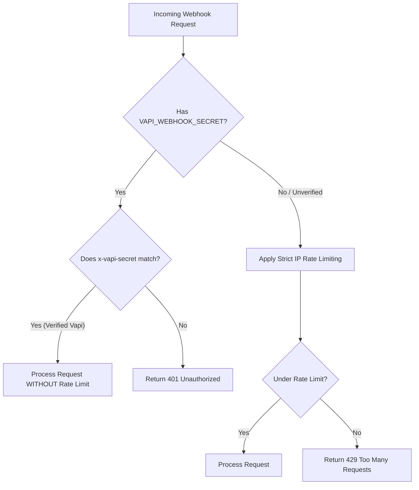

# Audit Report: Webhook Concurrency & IP Rate Limiting

## 1. Context & Setup
Voxora AI integrates with **Vapi.ai** to run real-time conversational voice agents for booking, rescheduling, and cancelling appointments. When a user interacts with the voice agent, Vapi translates the user's intent into tool calls and transmits them to our webhook endpoint at `/api/vapi-webhook`.

---

## 2. The Problem: Concurrency & Rate Limiting Conflict
Our webhook route currently applies security rate limits on incoming requests to prevent Denial of Service (DoS) and brute force attacks:
```typescript
const limiter = rateLimit(request, { limit: 20, windowMs: 60 * 1000 });
```

### The Scenario
If **5 different users** start calls at the same time, they will each speak with their respective voice bot.
During a typical 2-minute conversation, each voice agent will make 3 to 5 tool calls (e.g., checking availability, booking, rescheduling, or confirming).

### The Bottleneck
1. **Shared Origin IP**: Since all webhook requests are initiated by Vapi.ai's backend servers, they all arrive at our server from Vapi's egress IP address(es).
2. **Threshold Violation**: 5 parallel calls executing 4 tool calls each will generate **20+ requests in a single minute** coming from the exact same IP address.
3. **Dropped Requests (429)**: The rate limiter identifies this volume as an abuse attempt from a single IP and responds with a `429 Too Many Requests` error. This drops tool calls and causes the voice assistant to fail mid-call.

---

## 3. The Solution: Authenticated Bypass
To allow high-concurrency operations under heavy traffic while maintaining server security, we must authenticate the webhook requests before applying rate limiting.

### Verification Flow


### Key Enhancements
1. **Webhook Secret Check (`x-vapi-secret`)**: Read the header payload and check it against the environment secret.
2. **Conditional Limiting**: If verified, bypass rate limits. If not verified (e.g. public curl tests or unauthorized scanner traffic), enforce strict rate limits to protect the database.

---

## 4. Implementation Code

Modify `src/app/api/vapi-webhook/route.ts` as follows:

```typescript
export async function POST(request: Request) {
  try {
    const webhookSecret = process.env.VAPI_WEBHOOK_SECRET;
    let isAuthorizedVapi = false;

    // 1. Authorize webhook request using secret header
    if (webhookSecret) {
      const authHeader = request.headers.get("x-vapi-secret");
      if (authHeader === webhookSecret) {
        isAuthorizedVapi = true;
      } else {
        return NextResponse.json({ error: "Unauthorized" }, { status: 401 });
      }
    }

    // 2. Apply rate limiting ONLY to unauthenticated requests
    if (!isAuthorizedVapi) {
      const limiter = rateLimit(request, { limit: 20, windowMs: 60 * 1000 });
      if (!limiter.success) {
        return NextResponse.json(
          { error: "Too many requests" },
          {
            status: 429,
            headers: {
              "Retry-After": String(limiter.reset),
            },
          }
        );
      }
    }

    // 3. Process Webhook payload...
    const payload = await request.json();
    // ...
```
